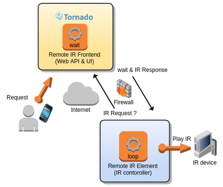
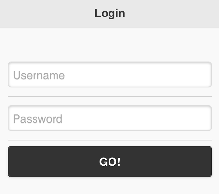
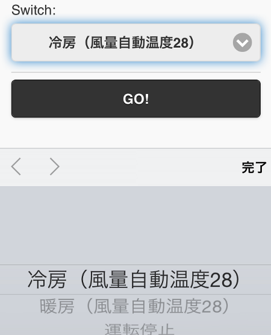
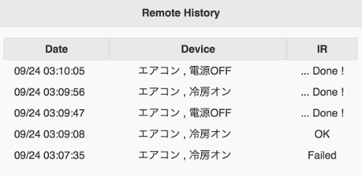

## Welcome to Remote IR Frontend

IR remocon WebAPI & UI

## Screenshots

1. Login 

 2. Remocon 

 3. Status 

 4. History 

## Getting Started

1. Install Python(>2.7) tornado:

        $ easy_install pip
        $ pip install tornado

2. Start web server:

        $ python server.py

   Run with `--help` or `-h` for options

        $ python server.py -h
        usage: server.py [-h] [-p PORT] [-user USERNAME] [-passwd PASSWORD]
        remote IR WebAPI & UI

        optional arguments:
          -h, --help                          show this help message and exit
          -p PORT, --port PORT                port number
          -user USERNAME, --user USERNAME     login username
          -passwd PASSWORD, --passwd PASSWORD login password

3. Using a browser, go to `http://localhost:8888/remocon/login` and you'll see login page.

   Default username, password: admin, password

4. Follow the guidelines to use application.

    * [netbuffalo's blog](http://netbuffalo.doorblog.jp/archives/4873455.html)
    * [RemoteIRE](https://github.com/netbuffalo/RemoteIRE)

## License

Released under the [MIT License](http://www.opensource.org/licenses/MIT).

